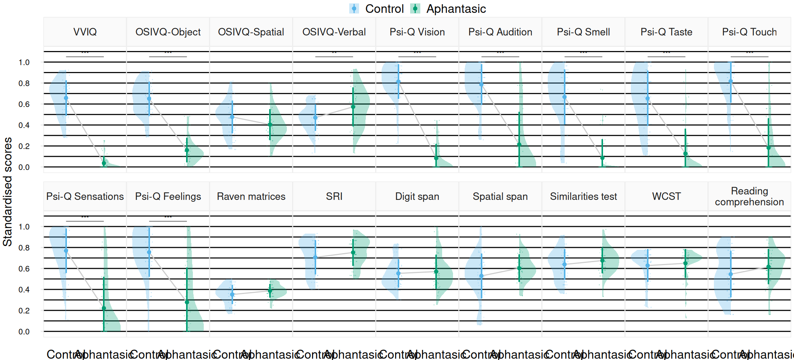
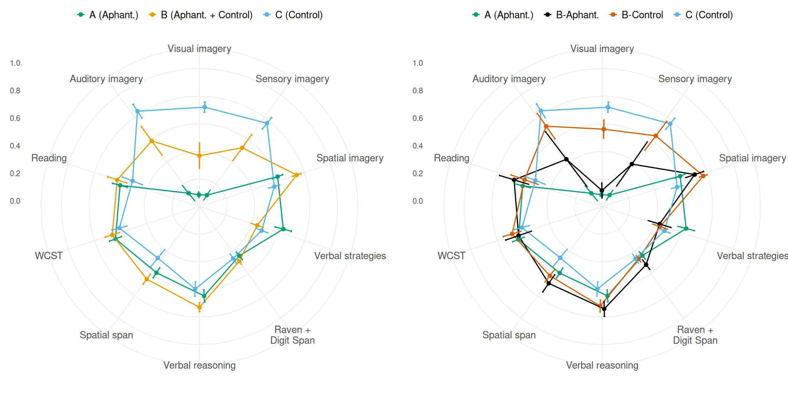

# Reproducible manuscript

## Unsupervised clustering reveals spatial and verbal cognitive profiles in aphantasia and typical imagery

**Keywords**: aphantasia, mental imagery, individual differences,
cognitive profiles, reasoning, working memory, unsupervised clustering

## 1 Introduction

Visual imagery, commonly referred to as “seeing with the mind’s eye”,
designates the pseudo-perceptual visual experience of mental images in
the absence of the corresponding external stimulus ([Pearson,
2019](#ref-pearsonHumanImaginationCognitive2019)). There are large
individual differences in visual imagery vividness (i.e. the intensity
and detail of mental images) across a spectrum going from the absence of
mental imagery, a phenomenon recently named “aphantasia” ([Zeman et al.,
2015](#ref-zemanLivesImageryCongenital2015)), to extremely vivid and
perception-like imagery, named “hyperphantasia” ([Zeman et al.,
2020](#ref-zemanPhantasiaPsychologicalSignificance2020)). The
introduction of the term “aphantasia” in 2015 led to a wave of research
on the subject, exploring its underlying causes and consequences and
potential positive or negative outcomes. A large body of research on
aphantasia mainly identified potential deficits associated with it.
Specifically, the condition has been associated with a reduction in
autobiographical memory ([Dawes et al.,
2020](#ref-dawesCognitiveProfileMultisensory2020),
[2022](#ref-dawesMemoriesBlindMind2022); [Milton et al.,
2021](#ref-miltonBehavioralNeuralSignatures2021); [Monzel, Leelaarporn,
et al., 2023](#ref-monzelHippocampaloccipitalConnectivityReflects2023)),
lack of atemporal and future imagination ([Milton et al.,
2021](#ref-miltonBehavioralNeuralSignatures2021)), increased face
recognition difficulties ([Milton et al.,
2021](#ref-miltonBehavioralNeuralSignatures2021); [Palermo et al.,
2022](#ref-palermoCongenitalLackExtraordinary2022); [Zeman et al.,
2020](#ref-zemanPhantasiaPsychologicalSignificance2020)), reduced dreams
([Dawes et al., 2020](#ref-dawesCognitiveProfileMultisensory2020)), or
decreased motor simulation ([Dupont et al.,
2024](#ref-dupontExplicitImplicitMotor2024)). This focus on deficits has
left the potential positive aspects of aphantasia largely unexplored,
even though empirical evidence from recent studies has shown that
individuals with aphantasia performed as well as those with “typical”
visual imagery in various types of tasks presumed to require this
ability, such as visual or visuo-spatial working memory ([Keogh et al.,
2021](#ref-keoghVisualWorkingMemory2021); [Pounder et al.,
2022](#ref-pounderOnlyMinimalDifferences2022); [Reeder et al.,
2024](#ref-reederNonvisualSpatialStrategies2024)). Research that hinted
at advantages of aphantasia have focused mainly on emotional processing.
Individuals with aphantasia have been shown to be less prone to sensory
sensitivity ([Dance et al., 2021](#ref-danceWhatLinkMental2021)), less
reactive to the reading of frightening scenarios ([Wicken et al.,
2021](#ref-wickenCriticalRoleMental2021)), and less sensible to
intrusive memories ([Keogh et al.,
2023](#ref-keoghFewerIntrusiveMemories2023)) suggesting that aphantasia
could help to reduce sensory overwhelm, and potentially protect against
emotional overreaction.

Recently, Monzel et al.
([2023](#ref-monzelAphantasiaFrameworkNeurodivergence2023)) proposed
that aphantasia should be understood within the framework of
“neurodivergence” as a state representing atypical but functional
cognitive processing, with advantages and disadvantages. The specifics
of this “alternative thinking” and its advantages, however, remain to be
understood. Interestingly, Zeman et al.
([2020](#ref-zemanPhantasiaPsychologicalSignificance2020)) found that
individuals with aphantasia seemed more likely to work in STEM fields
(Science, Technology, Engineering, and Mathematics), whereas
hyperphantasics, at the other end of the spectrum, were more likely to
work in art-related professions. Drawing on the patterns emerging from
their large-scale exploratory survey, Zeman et al.
([2020](#ref-zemanPhantasiaPsychologicalSignificance2020)) proposed a
broad hypothesis that, whereas hyperphantasia might be characterized by
an episodic and sensorily-rich mode of thinking, aphantasia might be
characterized by a more semantic and fact-oriented approach. The
visual/abstract polarity in thinking styles reflected in career
preferences observed by Zeman et al.
([2020](#ref-zemanPhantasiaPsychologicalSignificance2020)) is
reminiscent of work on the Object-Spatial-Verbal model of cognitive
styles developed by Blazhenkova & Kozhevnikov
([2009](#ref-blazhenkovaNewObjectspatialverbalCognitive2009)) and its
associated questionnaire (Object-Spatial Imagery and Verbal
Questionnaire, OSIVQ). Based on behavioural and neuroimaging studies on
healthy individuals ([Kosslyn et al.,
1995](#ref-kosslynCognitiveNeuroscienceMental1995); [Kozhevnikov et al.,
2002](#ref-kozhevnikovRevisingVisualizerVerbalizerDimension2002);
[Wallace, 1990](#ref-wallaceImageryVividnessHypnotic1990)) and
neuropsychological studies of brain-damaged patients ([Bartolomeo,
2002](#ref-bartolomeoRelationshipVisualPerception2002); [Farah et al.,
1988](#ref-farahCaseStudyMental1988)), Blazhenkova et al.
([2006](#ref-blazhenkovaObjectSpatialImagery2006)) showed that
visual-object imagery (imagery for colors, shapes, brightness, etc.)
could be dissociated from spatial imagery (imagery for location,
movement and orientation). Blazhenkova & Kozhevnikov
([2009](#ref-blazhenkovaNewObjectspatialverbalCognitive2009)) challenged
the prevailing Visualizer-Verbalizer model of cognitive styles ([Paivio
& Ernest, 1971](#ref-paivioImageryAbilityVisual1971); [Richardson,
1977](#ref-richardsonMeaningMeasurementMemory1977)) to introduce the
spatial dimension as a major form of imagery and cognitive style in its
own right, alongside visual and verbal styles. They showed that several
widely used paradigms, such as the Mental Rotation Task ([Shepard &
Metzler, 1971](#ref-shepardMentalRotationThreeDimensional1971)) or Paper
Folding Test ([Ekstrom,
1976](#ref-ekstromKitFactorreferencedCognitive1976)), often considered
visual, were not associated with visual imagery or visual cognitive
styles *per se*, but with spatial imagery and spatial cognitive styles
([Blazhenkova et al., 2006](#ref-blazhenkovaObjectSpatialImagery2006);
[Blazhenkova & Kozhevnikov,
2009](#ref-blazhenkovaNewObjectspatialverbalCognitive2009); [Kozhevnikov
et al., 2010](#ref-kozhevnikovTradeoffObjectSpatial2010); [Vannucci et
al., 2006](#ref-vannucciIndividualDifferencesVisuospatial2006)).
Consistent with the observation of Zeman et al.
([2020](#ref-zemanPhantasiaPsychologicalSignificance2020)) of a
prevalence of STEM occupations in aphantasia and artists in
hyperphantasia, several studies on the Object-Spatial-Verbal model have
shown visual-object cognitive styles to be particularly prevalent among
visual artists, while spatial styles are over-represented in scientific
fields and verbal styles prevail in literature and the humanities, both
among students and professionals ([Blazhenkova et al.,
2006](#ref-blazhenkovaObjectSpatialImagery2006); [Blazhenkova &
Kozhevnikov, 2009](#ref-blazhenkovaNewObjectspatialverbalCognitive2009),
[2010](#ref-blazhenkovaVisualobjectAbilityNew2010); [Kozhevnikov et al.,
2005](#ref-kozhevnikovSpatialObjectVisualizers2005); [Kozhevnikov et
al., 2010](#ref-kozhevnikovTradeoffObjectSpatial2010)). These results
are corroborated by various studies showing that spatial imagery is
preserved or enhanced in aphantasia, both on the subjective spatial
scale of the Object-Spatial Imagery Questionnaire (OSIQ, the first
version of the OSIVQ without the verbal scale, [Blazhenkova et al.,
2006](#ref-blazhenkovaObjectSpatialImagery2006)) and on various spatial
rotation, manipulation or spatial working memory tasks ([Bainbridge et
al., 2021](#ref-bainbridgeQuantifyingAphantasiaDrawing2021); [Dawes et
al., 2020](#ref-dawesCognitiveProfileMultisensory2020); [Keogh et al.,
2021](#ref-keoghVisualWorkingMemory2021); [Keogh & Pearson,
2018](#ref-keoghBlindMindNo2018); [Pounder et al.,
2022](#ref-pounderOnlyMinimalDifferences2022); [Reeder et al.,
2024](#ref-reederNonvisualSpatialStrategies2024); [Zeman et al.,
2015](#ref-zemanLivesImageryCongenital2015)).

Several studies have also revealed a wide range of spatial,
sensorimotor/kinaesthetic, verbal or amodal memory strategies reported
by individuals with aphantasia in (supposedly) visual tasks ([Keogh et
al., 2021](#ref-keoghVisualWorkingMemory2021); [Reeder et al.,
2024](#ref-reederNonvisualSpatialStrategies2024); [Zeman et al.,
2020](#ref-zemanPhantasiaPsychologicalSignificance2020)). The diversity
in modes of thinking could therefore be distributed across several
dimensions, including visual-object or spatial representation, but
potentially extending to verbal and semantic domains. The verbal (or
“propositional”) aspect of representations and cognitive strategies,
although often mentioned as a potential candidate for alternative
strategies in visual aphantasia, has scarcely been studied. Previous
articles that have examined the relevance of cognitive style models for
understanding aphantasia have focused on the object/spatial dissociation
([Blazhenkova & Pechenkova, 2019](#ref-blazhenkovaTwoEyesBlind2019);
[Palermo et al., 2022](#ref-palermoCongenitalLackExtraordinary2022)) or
the visual/verbal dissociation
([**beranAssessingAphantasiaPrevalence2023?**](#ref-beranAssessingAphantasiaPrevalence2023);
[**takahashiDiversityAphantasiaRevealed2023?**](#ref-takahashiDiversityAphantasiaRevealed2023))
but none so far have considered all three dimensions simultaneously. The
Object-Spatial-Verbal model of cognitive styles could allow to study
verbal representations in a coherent framework alongside visual and
spatial imagery and shed light on the cognitive strategies of
individuals with aphantasia. Therefore, the objective of the present
study was two-fold: (a) to explore the cognitive profiles of individuals
with aphantasia using the Object-Spatial-Verbal model of imagery and
cognitive styles theorised by Blazhenkova & Kozhevnikov
([2009](#ref-blazhenkovaNewObjectspatialverbalCognitive2009)), and (b)
to explore whether the profiles might be related to cognitive
performance.

We hypothesised that individuals with aphantasia would tend to adopt
spatial and verbal cognitive profiles, and that these profiles would be
associated with specific performance patterns. First, we hypothesised
that the profiles might be related to reasoning performance. Spatial
imagery is known to be involved and to play a major role in abstract
reasoning ([Wai et al., 2009](#ref-waiSpatialAbilitySTEM2009)). In this
context, the absence of visual imagery in aphantasia and the priority
and focus on spatial representations in aphantasia ([Bainbridge et al.,
2021](#ref-bainbridgeQuantifyingAphantasiaDrawing2021); [Keogh et al.,
2021](#ref-keoghVisualWorkingMemory2021); [Reeder et al.,
2024](#ref-reederNonvisualSpatialStrategies2024)) could be hypothesised
to facilitate abstract reasoning. Second, we hypothesised that spatial
or verbal cognitive profiles could explain individual differences in
working memory performance, depending on the modality involved. Previous
studies failed to find differences in working memory performance between
individuals with aphantasia and controls (e.g., [Keogh et al.,
2021](#ref-keoghVisualWorkingMemory2021); [Pounder et al.,
2022](#ref-pounderOnlyMinimalDifferences2022); [Reeder et al.,
2024](#ref-reederNonvisualSpatialStrategies2024)), but only took into
account variations on the visual-object dimension of imagery. Accounting
for the use of spatial and verbal representations in working memory
could provide insight into the processes and strategies underlying the
performance of individuals with aphantasia in various tasks ([Pearson &
Keogh, 2019](#ref-pearsonRedefiningVisualWorking2019)). Third, we put
forward the very general hypothesis that if individuals with aphantasia
have distinct verbal cognitive profiles, they should have very good
reading comprehension skills. However, some studies have established a
positive correlation between reading comprehension and visual mental
imagery (e.g., [Suggate & Lenhard,
2022](#ref-suggateMentalImagerySkill2022)), suggesting a central role
for the latter. Although similar reading habits have been observed in
people with aphantasia and those with typical imagery
([**speedRoleVisualImagery2024?**](#ref-speedRoleVisualImagery2024)), no
studies have yet been conducted on reading comprehension in an
ecological context in people with aphantasia. Such research could
provide a clearer picture of the advantages or disadvantages of
aphantasia in complex reading tasks involving verbal skills, working
memory and mental imagery. Finally, we hypothesised that the performance
of individuals with aphantasia in tasks supposed to require visual
imagery might be linked to a greater flexibility in switching to
alternative strategies (e.g. propositional, motor, etc.). In this case,
they should be characterised by particularly efficient executive
functioning. Thus, the present study also included a task designed to
probe executive functions.

In sum, the present study aimed to gain a better understanding of the
cognitive profiles of individuals with aphantasia and their strategies
for representing and processing information. We sought to identify
patterns of performance in accomplishing various cognitive tasks from
individuals with aphantasia and controls and relate these to their
subjective preferences for visual, spatial or verbal processing. To this
end, an online study was designed, integrating questionnaires and
behavioural tasks to assess visual imagery, spatial imagery, verbal
strategies, spatial, verbal and non-verbal reasoning, verbal and
visuo-spatial working memory, reading comprehension, and executive
functions. Based on previous work showing very few differences in
cognitive performance between individuals with aphantasia and controls
in memory tasks ([Keogh et al.,
2021](#ref-keoghVisualWorkingMemory2021); [Knight et al.,
2022](#ref-knightMemoryImageryNo2022); [Pounder et al.,
2022](#ref-pounderOnlyMinimalDifferences2022)), we expected that
dividing the participants into two groups according to visual imagery
ability would not fully explain substantial differences in task
performance. Thus, we planned to explore the hypothesis of hidden
sub-groups within the sample using a data-driven unsupervised clustering
method. This analysis was trans-categorical (including both groups) and
included all measures of cognitive abilities to assess similarities and
differences between participants beyond visual imagery. By
trans-categorical, we refer to an approach that goes beyond predefined
“diagnostic” categories to examine individual variability across
continuous and multidimensional spaces. Instead of assuming that
cognitive differences are fully explained by membership in an a priori
group defined with a single variable (aphantasic vs. typical imagery),
this approach considers profiles as overlapping and seeks latent
structures or emergent clusters that cut across categories using
multiple variables. For example, characteristic strengths in spatial or
verbal reasoning may appear in both individuals with and without
aphantasia, suggesting that these traits are not restricted to one group
but distributed along continua. This framework is particularly relevant
in cognitive psychology, where constructs such as imagery, memory, and
reasoning interact and vary from one individual to another, regardless
of predefined boundaries. The proposed data analysis plan resulted in
clusters characterized by their visual, spatial, and verbal cognitive
styles, which were able to explain task performance. In the light of
these patterns, we then discuss the potential of the
Object-Spatial-Verbal model for understanding cognitive processes and
strategies in aphantasia.

## 2 Methods

No part of the study procedures or analysis plan was preregistered prior
to the research being undertaken. We report all data exclusions, all
inclusion/exclusion criteria, all manipulations, and all measures in the
study.

### 2.1 Participants

Participants had to be French speakers, had normal or corrected vision
and none of the participants reported to have any known reading
disorders. They were recruited online both on groups unrelated to mental
imagery (social networks, French cognitive science information network,
etc.) and on groups dedicated to aphantasia and visual imagery. The
study link was sent to participants who volunteered by contacting the
team by email. The study was carried out following the recommendations
of the French Law (Loi Jardé n◦2012- 300), in accordance with the
ethical standards of the institutional research committee and with the
Declaration of Helsinki and its later amendments. Informed consent was
obtained from all individual participants included in the study .
Participation was without compensation. As the study was exploratory,
the sample size was not determined *a priori*. Only data from
participants who completed all the tasks were included in the analyses.
Participants who skipped a task extremely fast were removed from the
data. Of the 1200 people who opened the link to the study, 96 completed
all the tasks, making up the final sample. The questionnaire statistics
are detailed in the results part below.

### 2.2 Materials

#### 2.2.1 Questionnaires

The Vividness of Visual Imagery Questionnaire (VVIQ, [Marks,
1973](#ref-marksVisualImageryDifferences1973)) was used to assess visual
imagery ability. The VVIQ is a 16-item self-report scale that asks
participants to imagine a person and several scenes and to rate the
vividness of these mental images using a 5-point scale ranging from 1
(“*No imagery at all, you just know you’re thinking about the object*”)
to 5 (“*Perfectly clear and as vivid as normal vision*”). Scores range
from 16 to 80. The total score of 32, often used as a threshold to
define aphantasia ([Dawes et al.,
2020](#ref-dawesCognitiveProfileMultisensory2020); [Keogh et al.,
2021](#ref-keoghVisualWorkingMemory2021); e.g.,
[**dancePrevalenceAphantasiaImagery2022?**](#ref-dancePrevalenceAphantasiaImagery2022);
[**speedRoleVisualImagery2024?**](#ref-speedRoleVisualImagery2024)), is
equivalent to a score of 2 (“*vague and faint*”) for each item in the
questionnaire. The internal reliability (Cronbach’s $\alpha$) of the
VVIQ is .88 ([McKelvie, 1995](#ref-mckelvieVVIQPsychometricTest1995)).

The Object-Spatial Imagery and Verbal Questionnaire (OSIVQ, [Blazhenkova
& Kozhevnikov,
2009](#ref-blazhenkovaNewObjectspatialverbalCognitive2009)) was used to
evaluate imagery strategies and cognitive styles. The OSIVQ is a 45-item
scale that asks participants to indicate the extent to which each of the
statements applied to them, about visual-object imagery ability (e.g.,
“*When I imagine a friend’s face, I have a perfectly clear and bright
image*”), visuo-spatial imagery ability (e.g., “*My images tend to be
schematic representations of things and events rather than detailed
images*”) or verbal strategies for processing information (e.g., “*When
I remember a scene, I use verbal descriptions rather than mental
images*”), on a 5-point scale ranging from 1 (“*Totally disagree*”) to 5
(“*Totally agree*”). Each sub-scale (object, spatial, verbal) comprises
15 items whose values are added together to obtain a score ranging from
15 to 75. Cronbach’s $\alpha$ of the object, spatial and verbal scales
are .83, .79 and .74 respectively ([Blazhenkova & Kozhevnikov,
2009](#ref-blazhenkovaNewObjectspatialverbalCognitive2009)).

As mental imagery is a multi-sensory experience that is not limited to
vision, the Plymouth Sensory Imagery Questionnaire (Psi-Q, [Andrade et
al., 2014](#ref-andradeAssessingVividnessMental2014)) was used to assess
imagery vividness across various sensory modalities. The Psi-Q (in its
short form) comprises seven sets of three items for each of the
following modalities: *Vision*, *Hearing*, *Smell*, *Taste*, *Touch*,
*Bodily Sensation* and *Emotional Feeling*. Each set has a heading such
as “*Imagine the appearance of…*”} and then three items. Participants
were asked to rate their image on an 11-point scale anchored by 0 (“*No
image at all*”) and 10 (“*As vivid as real life*”), thus yielding scores
ranging from 0 to 33 for each modality. Cronbach’s $\alpha$ of the
21-item Psi-Q is .91 ([Andrade et al.,
2014](#ref-andradeAssessingVividnessMental2014)).

#### 2.2.2 Tasks

The Raven Standard Progressive Matrices (hereinafter called Raven
matrices, [Raven & Court, 1938](#ref-ravenRavenProgressiveMatrices1938))
is a widely-used assessment to estimate fluid intelligence (non-verbal
visual perception ability) and abstract reasoning (analogical and
deductive reasoning abilities). The Raven matrices contains 60 items
divided into five sets. Each question consists in completing a missing
figure in a matrix of $3 \times 3$ figures by extracting and following
the logical rules underlying the organisation of the matrices. Items are
of increasing difficulty. At the end of a set, the difficulty decreases
again but the logical rule changes, and the successive sets have
increasing difficulty. A shortened clinical version with two short forms
of 9 items developed by Bilker et al.
([2012](#ref-bilkerDevelopmentAbbreviatedNineItem2012)) was used,
predicting the 60-item score with good accuracy. Each of the short forms
had correlations of $r = .98$ with the long form, and respective
Cronbach’s $\alpha$ of .80 and .83. This shortened version represents a
70% reduction in the number of items to be administered and in
test-taking time, for psychometric characteristics similar to those of
the full form ([Bilker et al.,
2012](#ref-bilkerDevelopmentAbbreviatedNineItem2012)).

The Spatial Reasoning Instrument (SRI, [Ramful et al.,
2017](#ref-ramfulMeasurementSpatialAbility2017)) is a 30-item test for
measuring spatial ability along three constructs: mental rotation,
spatial orientation, and spatial visualisation. The test showed good
validity an psychometric properties in three areas: (a) the exploratory
factor analysis of the subscales (mental rotation, spatial orientation,
spatial visualisation), (b) the Rasch analysis of item reliability
within each construct, and (c) the significant correlations
($r \in \lbrack.33,.62\rbrack$) and person separation reliability with
four existing well-regarded instruments measuring spatial reasoning, the
Card Rotation Test, the Cube Comparison Test, the Paper Folding Test
\[all from Ekstrom
([1976](#ref-ekstromKitFactorreferencedCognitive1976))\] and the
Perspective Taking (Spatial Orientation) Test ([Kozhevnikov & Hegarty,
2001](#ref-kozhevnikovDissociationObjectManipulation2001)). The internal
reliability (Cronbach’s $\alpha$) of the SRI is .85.

The Similarities sub-test of the Weschler Adult Intelligence Scale
(WAIS-IV, [Wechsler et al.,
2008](#ref-wechslerWechslerAdultIntelligence2008)) is a well-known
assessment to estimate verbal comprehension abilities. Specifically,
this test assesses both verbal concept formation and verbal abstract
reasoning. It comprises 18 pairs of words in which the participant has
to identify the underlying qualitative relationship (e.g., “*How are
DREAM and REALITY similar?*”). Accurate answers (rated according to a
standardized response scale) receive two points, approximate answers one
point, and vague or incorrect answers zero, giving a maximum score of
36. After three zero scores, the task stops. Due to the internet-based
nature of the experiment, all participants passed all the items, but
only the *scoring* of their answers stopped after three incorrect
answers. The scoring was carried out manually, using double scoring by
the first two authors of this article, blind to the groups and
participants. All participants performed above the fifth percentile on
the Similarities WAIS-IV sub-test (score $\geq$ 12/36), thereby
confirming that none of the participants presented a deficit in semantic
oral language skills.

Reverse Corsi blocks is a spatial memory span task ([Gibeau,
2021](#ref-gibeauCorsiBlocksTask2021)) assessing visuo-spatial working
memory. The task consists in presenting the participant with a grid of
blocks in a frame, then displaying a sequence of blocks (the blocks
changing colours in turn), at a rate of one per second, and asking the
participant to recall it in reverse order, from the last block to the
first. The task began with a short sequence of three blocks, increasing
with each success or decreasing after two failures, over a fixed total
of 14 trials. The average number of blocks recalled correctly at the
correct position was retained as the score for the task.

The reverse digit span is a verbal memory span task assessing verbal
working memory ([Blackburn & Benton,
1957](#ref-blackburnRevisedAdministrationScoring1957)). The task
involves presenting numbers at a rate of 1 per second, and then asking
the participant to recall them from the last to the first. The task
begins with a short sequence of three digits, then lengthens with each
success or decreases after two failures, over a total of 14 trials. The
average number of digits recalled correctly at the correct position was
retained as the score for the task.

The Wisconsin Card Sorting Test (WCST, [Heaton & Staff,
1993](#ref-heatonWisconsinCardSorting1993)) is a widely used test of
set-shifting ability which was developed to measure flexibility of human
thought and the ability to shift cognitive strategy in response to
changing contingencies. The WCST is designed to measure executive
functioning including attentional set shifting, task/rule switching or
reversal, and working memory abilities. The assessment requires the
participants to sort 64 cards according to color (red, blue, yellow or
green), shape (cross, circle, triangle or star) or number of figures
(one, two, three or four). Over the course of the task, the sorting rule
discreetly changes from color to shape or number of figures, without the
participants being informed. Participants must modify their predictions
and choices accordingly and sort the cards according to the new sorting
rule: they receive feedback for their response (correct or incorrect),
which should enable them to improve with implicit rule extraction
([Nelson, 1976](#ref-nelsonModifiedCardSorting1976)). The final score
used was the percentage of correct sorts after 64 trials. The WCST,
scored according to the percentage (or number) of correct sorts,
exhibits satisfying split-half reliability (Spearman-Brown *r* = .90,
[Kopp et al., 2021](#ref-koppReliabilityWisconsinCard2021)).

The reading comprehension task assesses both explicit literal
comprehension and inferential comprehension skills and was designed for
assessment in adult readers ([Brèthes et al.,
2022](#ref-brethesTextReadingFluency2022)). Reading comprehension is a
complex cognitive activity that involves a number of skills including
word recognition skills, grammar, semantic and general knowledge,
working memory and reasoning skills as well as inference-making
abilities. This reading comprehension task was composed of three texts
drawn from the French daily newspaper *Le Monde*, all dealing with the
destruction of the Great Barrier Reef and its various causes. The
participant had to read each text without time constraints, then answer
eight questions: four questions about explicit literal comprehension and
four inferential questions about the comprehension of the implicit
information in the texts, among which two examined text-connecting
inferences and two examined knowledge-based inferences. While
text-connecting inference skills required participants to integrate text
information in order to establish local cohesiveness, knowledge-based
inference skills required participants to establish links between the
text content and their own personal knowledge. The questions were also
divided between two question formats: open questions and multiple-choice
questions. Participants were not allowed to refer to the text when
answering the questions. In all, the test contained 20 questions whose
answers were scored by the experimenter, with 2 points for complete
answers, 1 point for incomplete answers and 0 for incorrect answers. The
maximum score was therefore 40 points. The scoring was carried out
manually, using double scoring by the first two authors of the present
article, blind to the groups and participants. Cronbach’s $\alpha$ of
the task is 0.78.

### 2.3 Experimental design and procedure

The experiment was administered online via a JATOS server ([Lange et
al., 2015](#ref-langeJustAnotherTool2015)). It was programmed using
SurveyJS and jsPsych ([Leeuw et al.,
2023](#ref-leeuwJsPsychEnablingOpenSource2023)), open-source JavaScript
libraries dedicated to the creation of questionnaires and experiments
respectively, as well as OpenSesame ([Mathôt et al.,
2012](#ref-mathotOpenSesameOpensourceGraphical2012)), a graphical
interface for the construction of behavioural experiments. The link to
the experiment was emailed individually to each volunteer participant
and could only be used once per participant.

All participants were subjected to the same study design and task
sequence. Before the first questionnaires, participants gave their
consent, then demographic data were collected (first language, age,
gender, occupation, education and field of study, vision). Due to the
length of the protocol (Median time spent = 84.58 min, Median Absolute
Deviation = 27.51 min), the experiment was structured with instructions
accompanied by pages of explanations to reinforce engagement and focus
(e.g., inviting people to “dive into their minds” or “test their
abilities”). No text mentioned the word aphantasia, to avoid the stigma,
bias or preconceived ideas specifically associated with this term (see
[Cabbai et al., 2023](#ref-cabbaiInvestigatingRelationshipsTrait2023);
[Monzel, Dance, et al.,
2023](#ref-monzelAphantasiaFrameworkNeurodivergence2023)). The
experiment started with the VVIQ, followed by the Raven matrices, the
WCST, the OSIVQ, the SRI, the reverse Corsi blocks, the Similarities
test, the Reading comprehension task, the reverse digit span, and ended
with the Psi-Q. None of the tasks had a time limit, but participants
were instructed to respond as soon as they had the answer while
maintaining accuracy, with the aim of reducing the total duration of the
experiment for them. However, given that the experiment was long, that
the participants were not monitored due to the online format, and that
the instructions did not place particular emphasis on speed of response
as a key aspect, response times were not analysed.

### 2.4 Analyses

All analyses were conducted using the R statistical language ([R Core
Team, 2024](#ref-R-base)) on RStudio ([Posit team, 2025](#ref-Rstudio)).
Data curation was handled in R with packages from the *tidyverse*
collection ([Wickham et al., 2019](#ref-tidyverse2019)). All
visualisations were produced with the packages *ggplot2* ([Wickham,
2016](#ref-ggplot22016)), *factoextra* ([Kassambara & Mundt,
2020](#ref-R-factoextra)), *see* ([Lüdecke et al., 2021](#ref-see2021)),
*superb* ([Cousineau et al., 2021](#ref-superb2021)) and *patchwork*
([Pedersen, 2024](#ref-R-patchwork)).

Bayesian modelling used throughout the analyses was conducted using the
R packages *rstanarm* ([Gabry & Goodrich, 2024](#ref-R-rstanarm)),
*BayesFactor* ([Morey & Rouder, 2024](#ref-R-BayesFactor)) and
*bayestestR* ([Makowski et al., 2019](#ref-bayestestR2019)), using
default weakly informative priors. The R package *emmeans* ([Lenth,
2024](#ref-R-emmeans)) was used for marginal estimates and contrast
analyses. For all tests, the statistic reported,
$log\left( BF_{10} \right)$, quantifies the relative “weight of
evidence” in favour of the hypothesis $H_{1}$ (e.g., the effect of a
factor), against the null hypothesis $H_{0}$([Good,
1985](#ref-goodWeightEvidenceBrief1985)). According to Jeffrey’s scale
thresholds (see [Kass & Raftery, 1995](#ref-kassBayesFactors1995)),
$log\left( BF_{10} \right) \in \lbrack 0;0.5\lbrack$ = “*Barely worth
mentioning*”; $\in \lbrack 0.5;1\lbrack$ = “*Substantial evidence*”;
$\in \lbrack 1;2\lbrack$ = “*Strong evidence*”;
$\in \lbrack 2;+\infty\lbrack$ = “*Decisive evidence*”. The same
negative thresholds apply for the weight of evidence in favour of
$H_{0}$.

## 3 Results

The final sample comprised 96 participants ($M_{age}$ = 32.5, $SD_{age}$
= 11.3, range$_{age}$ = \[19, 65\], 74 females, 21 males, 1 another
gender). The most widely used criterion in studies on aphantasia to
identify the condition is a score inferior to 32 on the VVIQ, a
threshold often used in the literature ([Dawes et al.,
2020](#ref-dawesCognitiveProfileMultisensory2020); [Keogh et al.,
2021](#ref-keoghVisualWorkingMemory2021); e.g.,
[**dancePrevalenceAphantasiaImagery2022?**](#ref-dancePrevalenceAphantasiaImagery2022);
[**speedRoleVisualImagery2024?**](#ref-speedRoleVisualImagery2024)).
There were 45 individuals with aphantasia in the sample ($M_{VVIQ}$ =
18.3, $SD_{VVIQ}$ = 4.2, $M_{age}$ = 33.8, $SD_{age}$ = 10.6, 37
females, 8 males) and 51 controls ($M_{VVIQ}$ = 58.1, $SD_{VVIQ}$ =
10.8, $M_{age}$ = 31.4, $SD_{age}$ = 11.8, 37 females, 13 males, 1
another gender).

### 3.1 VVIQ groups analysis

#### 3.1.1 Education and occupation

Participants’ level of education, field of study, and occupation were
analysed to detect any association with the grouping factor. Levels of
education were coded using the equivalent of the French levels in the
International Standard Classification of Education (ISCED), i.e., *Upper
secondary*, *Post-secondary*, *Bachelor*, *Master*, and *Doctorate*.
Fields of study have been coded according to the 10 broad categories
defined by the ISCED-F 2013 (ISCED: Fields of Education and Training).
Occupations have been coded according to the sub-major groups of the
International Standard Classification of Occupations (ISCO-08) for an
appropriate level of precision given our sample size. Nine occupational
groups were identified in the sample. Bayes factors for independence
were calculated to evaluate the association between groups and each
demographic variable (see [Gûnel & Dickey,
1974](#ref-gunelBayesFactorsIndependence1974)). The tests found evidence
against a relationship between groups and levels of education
($log\left( BF_{10} \right)$ = -4.88), groups and fields of study
($log\left( BF_{10} \right)$ = -5.41), or groups and occupation
($log\left( BF_{10} \right)$ = -4.37).

#### 3.1.2 Questionnaire and task results

The measured variables were the scores on the VVIQ, the three OSIVQ
scales, the seven Psi-Q scales, the Raven matrices, the SRI, the
Similarities Test, the reverse spatial and verbal spans, the WCST and
the Reading comprehension task. Linear models have been fitted to the
various variables to model them with participant groups as categorical
predictors and age as a continuous covariate so as to control for the
potential influence of the latter. Contrast analyses were thereafter
conducted to assess the differences between the groups. All score
differences (hereinafter referred to as $\Delta$) and their 95% Credible
Intervals are reported in [Table 1](#tbl-g-results) along with the
$log\left( BF_{10} \right)$ quantifying the weight of evidence in favour
of a non-null difference between the groups.

Individuals with aphantasia had lower scores than controls in all visual
imagery scales (VVIQ: $log\left( BF_{10} \right)$ = 64.33; OSIVQ-Object:
$log\left( BF_{10} \right)$ = 37.94; Psi-Q Visual:
$log\left( BF_{10} \right)$ = 58.94), but also on all other sensory
imaging modalities evaluated by the Psi-Q
($log\left( BF_{10} \right) \in \lbrack 14;31\rbrack$ for all
modalities). All means and contrasts between the groups are represented
with their distributions in [Figure 1](#fig-g-violins). Apart from
sensory imagery, evidence was found in favour of a difference between
the groups on the verbal scale of the OSIVQ, with individuals with
aphantasia scoring higher than controls ($\Delta$ = -6.39, 95% CrI =
\[-10.12, -2.53\], $log\left( BF_{10} \right)$ = 1.63). No differences
between the groups were found on all other variables: the statistical
analyses showed evidence against a difference on the spatial scale of
the OSIVQ ($log\left( BF_{10} \right)$ = -0.7), against differences in
Raven matrices scores ($log\left( BF_{10} \right)$ = -1.3), SRI scores
($log\left( BF_{10} \right)$ = -2.2), spatial span
($log\left( BF_{10} \right)$ = -1.01), digit span
($log\left( BF_{10} \right)$ = -3.28), Similarities test scores
($log\left( BF_{10} \right)$ = -2.68), Reading comprehension scores
($log\left( BF_{10} \right)$ = -1.94) and WCST scores
($log\left( BF_{10} \right)$ = -3.22).

[](https://m-delem.github.io/aphantasiaCognitiveClustering/articles/manuscript_files/figure-html/fig-g-violins-1.png "Figure 1: Standardised scores of the two VVIQ groups on all the questionnaires and tasks. The scores have been rescaled between 0 and 1 to be represented on the same scale. The coloured shapes represent the distribution of the scores in each group. The coloured dots represent the mean of each group, while the bars represent the standard deviations. The stars represent weight of evidence thresholds in favour of an effect of the Group: * = ‘Substantial evidence’, ** = ‘Strong evidence’, *** = ‘Decisive evidence’.")

Figure 1: Standardised scores of the two VVIQ groups on all the
questionnaires and tasks. The scores have been rescaled between 0 and 1
to be represented on the same scale. The coloured shapes represent the
distribution of the scores in each group. The coloured dots represent
the mean of each group, while the bars represent the standard
deviations. The stars represent weight of evidence thresholds in favour
of an effect of the Group: \* = ‘*Substantial evidence*’, \*\* =
‘*Strong evidence*’, \*\*\* = ‘*Decisive evidence*’.

The VVIQ model—i.e., the division of the sample into two VVIQ groups of
individuals with aphantasia and controls—therefore had very little
explanatory power on task performance. However, large inter-individual
variances were observed in various outcomes, as evidenced by the spread
of the outcomes’ distributions and several bimodal distributions (e.g.,
distributions of the OSIVQ-Verbal, SRI, or Reading comprehension scores,
see [Figure 1](#fig-g-violins)). These unexplained differences suggested
the existence of an underlying structure in our sample, thus requiring a
better model with more relevant groups to account for them in light of
our data. We studied this hypothesis by searching for sub-groups in the
sample using data-driven unsupervised clustering.

### 3.2 Cluster analysis

#### 3.2.1 Correlation structure and variable selection

The selection of relevant variables for clustering is essential for good
model fit and interpretation of the results ([Fop & Murphy,
2018](#ref-fopVariableSelectionMethods2018); [Zakharov,
2016](#ref-zakharovApplicationKmeansClustering2016)). Having an adequate
number of dimensions (variables) for a given sample size is also crucial
to increase the quality of the clustering ([Psutka & Psutka,
2019](#ref-psutkaSampleSizeMaximumlikelihood2019)). The identification
and reduction of *redundant variables* is particularly important, so as
not to distort the relative weight of each latent variable in the
clustering process. If two variables represent the same concept, that
concept would be represented twice in the data and hence get twice the
weight as all the other variables. The final solution could be skewed in
the direction of that concept, which would considerably compromise the
relevance of the model for understanding variable importance ([Kyriazos
& Poga, 2023](#ref-kyriazosDealingMulticollinearityFactor2023)). In the
present analysis, this issue particularly affected sensory imagery,
which was represented by nine highly correlated variables (VVIQ,
OSIVQ-Object, and the seven Psi-Q modalities, Pearson’s
$r \in \lbrack 0.65,0.94\rbrack$ for every pairwise correlation) that
were likely to reflect very similar constructs, as opposed to the
remaining nine variables. Several methods exist to deal with such
multicollinearity problems. In our low-dimensional setting, we chose to
merge variables by averaging them to maintain interpretability while
enhancing the stability of the model ([Kyriazos & Poga,
2023](#ref-kyriazosDealingMulticollinearityFactor2023)). To choose which
variables to merge, we analysed the relationships between the variables
using partial correlations. Partial correlations measure the degree of
association between two variables while controlling for the effect of
other potentially confounding covariates ([Abdi,
2007](#ref-abdiPartSemiPartial2007)). This procedure allows to identify
the strongest unbiased links between variables and prevents
misinterpretation of spurious correlations.

We computed all the partial correlations between the 18 variables (see
[Figure 2](#fig-corrs)) and chose to merge the significantly correlated
variables after a Bonferroni correction (multiplying the *p*-values by
the number of comparisons). This resulted in the creation of four new
reduced variables. First, the three subscales related to visual imagery,
i.e., the VVIQ, the OSIVQ-Object and Psi-Q Visual, were associated
(VVIQ - Psi-Q Visual: *r* = 0.67, *p* $<$ 0.001; OSIVQ-Object - Psi-Q
Visual: *r* = 0.36, *p* $<$ 0.05). They have been standardised between 0
and 1, weighted by their number of items (16, 15 and 3 respectively) and
merged into a single “*Visual imagery*” variable to obtain as balanced a
continuous measure of imagery as possible. Second, the OSIVQ-Spatial and
the score of the SRI, i.e., subjective and objective spatial imagery,
were associated (*r* = 0.36, *p* $<$ 0.05). They have been standardised
and merged in a single “*Spatial imagery*” variable. Third, five Psi-Q
sensory imagery subscales (Smell, Taste, Touch, Sensations and Feelings)
were associated (Psi-Q Smell - Taste: *r* = 0.47, *p* $<$ 0.001; Taste -
Touch: *r* = 0.38, *p* $<$ 0.05; Touch - Sensations: *r* = 0.41, *p* $<$
0.01; Sensations - Feelings: *r* = 0.39, *p* $<$ 0.05). They have been
standardised and merged into a single “*Sensory imagery*” variable.
Fourth, the score for the Raven matrices and the Digit span were
associated (*r* = 0.37, *p* $<$ 0.05). They have been standardised and
merged in a common “*Raven + Digit*” variable. Based on the link
established between the reverse digit span and measures of intellectual
or executive functions ([Groeger et al.,
1999](#ref-groegerMeasuringMemorySpan1999)), we interpreted this
variable theoretically as a proxy for general cognitive performance.

 nodes highlight the variables used for clustering, some of which are the result of merging of several correlated variables. Light blue: Visual imagery; dark blue: Sensory imagery; light orange: Spatial imagery; green: Verbal strategies; pink: Raven + Digit; dark orange: Verbal reasoning.")

Figure 2: Correlation matrix and undirected graph representing the
partial correlations between the 18 variables. The stars in the matrix
represent p-value thresholds: \* : p $<$ 0.05, \*\* : p $<$ 0.01, \*\*\*
: p $<$ 0.001, after a Bonferroni correction. The links in the graph
represent significant partial correlations. The coloured (non-black)
nodes highlight the variables used for clustering, some of which are the
result of merging of several correlated variables. Light blue: Visual
imagery; dark blue: Sensory imagery; light orange: Spatial imagery;
green: Verbal strategies; pink: Raven + Digit; dark orange: Verbal
reasoning.

Finally, three variables were not included in the clustering. The Psi-Q
Auditory was the only Psi-Q subscale that was not associated with other
variables. As it comprises only three items, this variable was not
included in the clustering to avoid giving it undue importance. The WCST
and Reading comprehension scores were not used either, as these tasks
are designed to evaluate higher-level abilities that operate at more
integrated levels of cognition. Executive functioning and reading
comprehension inextricably involve a mix of working memory, reasoning
and attention ([Heaton & Staff,
1993](#ref-heatonWisconsinCardSorting1993); [Kongs et al.,
2000](#ref-kongsWCST64WisconsinCard2000); [Suggate & Lenhard,
2022](#ref-suggateMentalImagerySkill2022)), and are likely to integrate
many redundant processes with the other assessments. Instead, these
variables were used *a posteriori* as testing variables to assess the
generalisability of the cluster model to external variables, i.e., to a
related sensory imagery subscale for the Psi-Q Auditory, and to complex
cognitive tasks for the other two. This decision was not planned before
the study, but it was decided before conducting the cluster analysis
based on variable reduction and theoretical considerations.

This entire selection procedure allowed to reduce the variable space to
seven dimensions, estimated by Psutka & Psutka
([2019](#ref-psutkaSampleSizeMaximumlikelihood2019)) to yield a good
accuracy of parameter recovery for model-based clustering (see next
section) on a sample *N* = 96. As a result, other variables were not
modified to keep as much information as possible. For the sake of
clarity, several scores have been renamed to reflect what they assess.
The OSIVQ-Verbal score was identified as the propensity to use *Verbal
strategies* for information processing, in line with the definition of
this sub-scale (see [Blazhenkova & Kozhevnikov,
2009](#ref-blazhenkovaNewObjectspatialverbalCognitive2009)). The
Similarities test score was identified as a *Verbal Reasoning* variable.
The clustering process was therefore conducted on the seven following
variables: *Visual imagery*, *Sensory imagery*, *Spatial imagery*,
*Verbal strategies*, *Raven + Digit span*, *Verbal reasoning* and
*Spatial span*. To model variables using the same scale, data were
normalized between 0 and 1 from their respective scales, as recommended
by Zakharov ([2016](#ref-zakharovApplicationKmeansClustering2016)).

#### 3.2.2 Model-based clustering and number of clusters

A model-based method was chosen for clustering. In this approach,
clustering aims at modelling distributions with mixtures of multivariate
Gaussian distributions ([Steinley & Brusco,
2011](#ref-steinleyEvaluatingMixtureModeling2011)). Finite Gaussian
mixture models (GMM) attempt to determine the underlying population
groups that produced the observed data, each cluster being a
distribution with its own centre and spread. The resulting model is then
used to compute the probability of each observation belonging to a
cluster. Although discrete (k-means) or hierarchical clustering methods
are frequently used in psychology ([Zakharov,
2016](#ref-zakharovApplicationKmeansClustering2016)), probabilistic
mixture modelling approaches have proven to be more powerful and
parsimonious with partially overlapping, non-spherical, multivariate
normal distributions, and small sample sizes, all of which are common in
psychology experiments ([Dalmaijer et al.,
2022](#ref-dalmaijerStatisticalPowerCluster2022)).

Given that very little information is available on the clusters, the
estimation of the GMM proceeds in steps, alternating between (1)
estimating the posterior probability of each observation belonging to
each cluster with a fixed set of parameters and (2) updating the
estimates of the parameters by fixing the probability of cluster
membership for each observation ([Steinley & Brusco,
2011](#ref-steinleyEvaluatingMixtureModeling2011)). This iterative
procedure continues until the model converges on stable clusters. The
standard method for this estimation is the expectation-maximisation
algorithm (EM, [Dempster et al.,
1977](#ref-dempsterMaximumLikelihoodIncomplete1977))[¹](#fn1). In the
present study, the *mclust* R package ([Scrucca et al.,
2023](#ref-mclust2023)) was used to conduct GMM clustering. The
estimation procedure for the mixture of clusters in the GMM requires
knowledge of the number of clusters and their distributional form. The
determination of these parameters was done using the Bayesian
Information Criterion (BIC) implemented in the *mclust* package.

[](https://m-delem.github.io/aphantasiaCognitiveClustering/articles/manuscript_files/figure-html/fig-bic-1.png "Figure 3: Comparison of the goodness of fit of different mixture models used for clustering as a function of model type and number of components. A high BIC indicates a good model fit. The three-letter acronyms describe the components of the mixture models. The first letter describes the volume of the components, the second their shape and the last their orientation. E = equal, V = variable. Acronyms ending with ‘II’ indicate mixtures of spherical components, those ending with ‘I’ indicate mixtures of diagonal components and those without ‘I’ indicate mixtures of ellipsoidal components.")

Figure 3: Comparison of the goodness of fit of different mixture models
used for clustering as a function of model type and number of
components. A high BIC indicates a good model fit. The three-letter
acronyms describe the components of the mixture models. The first letter
describes the volume of the components, the second their shape and the
last their orientation. E = equal, V = variable. Acronyms ending with
‘II’ indicate mixtures of spherical components, those ending with ‘I’
indicate mixtures of diagonal components and those without ‘I’ indicate
mixtures of ellipsoidal components.

There are no generally accepted rules regarding minimum sample sizes in
clustering procedures. For model-based clustering procedures Dalmaijer
et al. ([2022](#ref-dalmaijerStatisticalPowerCluster2022)) recommended
*N* = 20 to *N* = 30 per expected cluster with medium to large effect
sizes (i.e., cluster separation), which would translate into two to four
clusters in our sample. Given the present dataset, the comparison of
various GMM types with different number of clusters using the BIC showed
that the best solution was a model with three ellipsoidal clusters of
varying shapes, equal volume and orientations (EVE model, see
[Figure 3](#fig-bic)).

#### 3.2.3 Clustering results

The profiles of the three clusters obtained are presented in
[Figure 4](#fig-cluster-radar-plots) (left panel). **Cluster A** was
made up exclusively of individuals with aphantasia ($N_{A}$ = 32),
**Cluster B** was mixed ($N_{B}$ = 30), comprising 17 controls and 13
individuals with aphantasia, while **Cluster C** was composed solely of
control participants ($N_{C}$ = 34). Bayes factors for independence
found no association between clusters and levels of education
($log\left( BF_{10} \right)$ = -7.44), clusters and fields of study
($log\left( BF_{10} \right)$ = -6.06), or clusters and occupation
($log\left( BF_{10} \right)$ = -3.88).

 and standard errors (error bars) of the three clusters on the seven clustering variables and the three external variables (Auditory imagery, WCST and Reading comprehension). Cluster A is exclusively composed of individuals with aphantasia, Cluster C is exclusively composed of control participants, and Cluster B is mixed. Right: Same polar plot with Cluster B divided into two sub-clusters, ‘B-Aphant.’ with the 13 individuals with aphantasia in B, and ‘B-Control’ with the 17 control participants in B.")

Figure 4: Profiles of the clusters obtained through model-based
clustering. **Left:** Polar plot representing the standardised means
(points) and standard errors (error bars) of the three clusters on the
seven clustering variables and the three external variables (Auditory
imagery, WCST and Reading comprehension). Cluster A is exclusively
composed of individuals with aphantasia, Cluster C is exclusively
composed of control participants, and Cluster B is mixed. **Right:**
Same polar plot with Cluster B divided into two sub-clusters,
‘B-Aphant.’ with the 13 individuals with aphantasia in B, and
‘B-Control’ with the 17 control participants in B.

Cluster scores were modelled with the clusters as predictors using the
same linear Bayesian modelling as described above for modelling
variables with the groups. All detailed pairwise differences between the
clusters and their 95% Credible Intervals are reported in
[Table 2](#tbl-c-contrasts) along with weights of evidence in favour of
differences between clusters. The three clusters had very distinctive
features on the visual, sensory, spatial and verbal dimensions of their
cognitive profiles. As seen, for Visual and Sensory imagery, Controls
(cluster C) had much higher scores than the mixed cluster (cluster B)
which itself had higher scores than the Aphantasic cluster (cluster A;
all $log\left( BF_{10} \right) \geq$ 3.99). Cluster B had higher scores
than the other two clusters in Spatial imagery (both
$log\left( BF_{10} \right) \geq$ 5.52), which did not differ from each
other ($log\left( BF_{10} \right)$ = -1.74). In turn, cluster A had
higher scores than the other two in Verbal strategies (both
$log\left( BF_{10} \right) \geq$ 4.31), for which B and C did not differ
($log\left( BF_{10} \right)$ = -3.19). Else, cluster B outperformed
cluster C in verbal reasoning and spatial span (both
$log\left( BF_{10} \right) \geq$ 3.33), but no differences were found
between cluster A and the other two on these scores (all
$log\left( BF_{10} \right) \leq$ 0.16). Finally, for the Raven + Digit
span variable, the differences between the clusters were negligible (all
$log\left( BF_{10} \right) \leq$ -2.2).

We also modelled the variables excluded from the clustering procedure,
i.e., Auditory imagery, WCST and reading comprehension scores, to assess
how the cluster patterns transferred to external variables. They are
seen at the bottom of [Table 2](#tbl-c-contrasts). The imagery patterns
were maintained for Auditory imagery, where cluster C scored higher than
B ($log\left( BF_{10} \right)$ = 2.33), which in turn scored higher than
A ($log\left( BF_{10} \right)$ = 11.37). However, although the mean
cluster scores on the WCST and reading comprehension followed the same
trend as the other cognitive tasks (i.e. B $>$ A $>$ C — WCST: $M_{B}$
($SD_{B}$) = 0.66 (0.14); $M_{A}$ ($SD_{A}$) = 0.65 (0.13); $M_{C}$
($SD_{C}$) = 0.6 (0.16) — Reading comprehension: $M_{B}$ ($SD_{B}$) =
0.63 (0.2); $M_{A}$ ($SD_{A}$) = 0.6 (0.16); $M_{C}$ ($SD_{C}$) = 0.52
(0.23)), there was evidence for an absence of differences between
clusters (highest $log\left( BF_{10} \right)$ = -1.26).

Dividing the controls and individuals with aphantasia within cluster B
into two “sub-clusters” provided further insights on the profiles in the
sample (see [Figure 4](#fig-cluster-radar-plots), right panel; details
of all 60 pairwise comparisons can be found in the extended analysis
report on the OSF at <https://osf.io/7vsx6/>). This allowed to assess
imagery differences that might have been biased by averaging imagery
scores in this mixed cluster. First, comparisons between controls from B
(noted $B_{C}$) and from C showed that C had higher visual imagery than
$B_{C}$ ($log\left( BF_{10} \right)$ = 6.96), but comparable sensory
imagery ($log\left( BF_{10} \right)$ = -0.78) and auditory imagery
scores ($log\left( BF_{10} \right)$ = -2.36). As observed above,
B-Controls had higher spatial imagery ($log\left( BF_{10} \right)$ =
9.56), spatial span ($log\left( BF_{10} \right)$ = 1.53) and verbal
reasoning scores ($log\left( BF_{10} \right)$ = 0.76), but no
differences in verbal strategies ($log\left( BF_{10} \right)$ = -3.31)
or Raven + Digit span ($log\left( BF_{10} \right)$ = -3.35). These
comparisons show that the main imagery differences between the B and C
controls lie in visual and spatial imagery, indicating that the
differences in performance observed in the tasks could be related to the
balance between the two, a high visual imagery being associated with
lower performance.

Last, comparisons between individuals with aphantasia from A and from B
(noted $B_{A}$) confirmed their differences in verbal strategies in
favour of A ($log\left( BF_{10} \right)$ = 3.79), and in spatial imagery
in favour of $B_{A}$ ($log\left( BF_{10} \right)$ = 1.16), along with an
absence of differences in Raven + Digit span
($log\left( BF_{10} \right)$ = -0.88), spatial span
($log\left( BF_{10} \right)$ = -2.02), and verbal reasoning
($log\left( BF_{10} \right)$ = -1.18). However, the contrasts also
revealed that, although the two had comparable visual imagery
($log\left( BF_{10} \right)$ = -4.02), $B_{A}$ had higher sensory
imagery than A ($log\left( BF_{10} \right)$ = 2.46). This difference
also existed in auditory imagery ($log\left( BF_{10} \right)$ = 1.35),
which was not used as a variable for clustering. The differences in
verbal strategies, spatial imagery, sensory and auditory imagery between
A and $B_{A}$ aphants point to the existence of aphantasia subgroups
with major mental imagery and cognitive style differences extending
beyond visual imagery.

## 4 Discussion

The present study investigated the cognitive profiles of individuals
with and without aphantasia and how these profiles influence their
performance on various cognitive tasks. To this end, we examined key
aspects of subjective experiences, including visual and sensory imagery,
spatial imagery, and verbal strategies, using questionnaires.
Additionally, reasoning, working memory, executive functioning, and
reading comprehension were assessed through a battery of behavioural
tasks.

The initial analyses, comparing individuals with aphantasia to controls
based on conventional measures, revealed few significant differences in
performance. While individuals with aphantasia demonstrated reduced
sensory imagery and a stronger reliance on verbal strategies,
differences in spatial imagery and other cognitive tasks, such as
reasoning or memory, were minimal. These findings aligned with previous
research emphasizing the limited impact of aphantasia in many
behavioural tasks (e.g., [Bainbridge et al.,
2021](#ref-bainbridgeQuantifyingAphantasiaDrawing2021); [Keogh et al.,
2021](#ref-keoghVisualWorkingMemory2021); [Knight et al.,
2022](#ref-knightMemoryImageryNo2022); [Pounder et al.,
2022](#ref-pounderOnlyMinimalDifferences2022)). However, a clustering
analysis using a Gaussian Mixture Model (GMM) identified a cluster
structure within the dataset. By leveraging variables related to visual,
sensory, and spatial imagery, verbal strategies, and cognitive abilities
(i.e., Raven matrices, digit span, spatial span, and verbal reasoning),
the algorithm suggested the presence of three distinct cognitive
profiles, each with unique characteristics in visual, sensory, and
spatial imagery, as well as verbal strategies. One cluster, exclusively
composed of controls, demonstrated high visual and sensory imagery,
strongly relying on visual-object representations. Another mixed
cluster, including both individuals with aphantasia and controls,
exhibited strong spatial imagery and performed best on spatial span and
verbal reasoning tasks. The final cluster consisted entirely of
individuals with aphantasia, who displayed multisensory aphantasia
(reduced sensory, auditory, and visual imagery) and a reliance on verbal
strategies. This clustering revealed complex, multidimensional patterns
of cognitive abilities and imagery preferences that extended beyond the
binary categorization of aphantasia versus control, offering a rich and
nuanced picture of the relationships between mental imagery and
cognition.

If we focus only on the Control participants, the cluster analyses
revealed important subgroup distinctions. Controls could be divided into
two subgroups: one with highly vivid visual imagery but reduced spatial
imagery (cluster C) and another with the opposite pattern, characterized
by stronger spatial imagery (cluster $B_{C}$). These distinctions held
important implications for task performance. Individuals with higher
spatial imagery outperformed their counterparts with stronger visual
imagery in tasks requiring reasoning and working memory, such as spatial
span and verbal reasoning tasks. Interestingly, both groups performed
similarly on tasks involving non-verbal reasoning (Raven matrices) and
reverse digit span, suggesting that the observed differences were not
due to overall disparities in cognitive ability but were specific to
differences in imagery style. These results emphasize the importance of
spatial imagery in abstract reasoning and suggest that vivid visual
imagery may sometimes impede these processes. This is consistent with
the “visual imagery impedance hypothesis” ([Knauff & Johnson-Laird,
2002](#ref-knauffVisualImageryCan2002)), which posits that overly
detailed visual representations can disrupt reasoning by introducing
irrelevant information. These findings not only reinforce the relevance
of spatial imagery in cognitive profiles but also raise questions about
its relationship with visual imagery, highlighting potential trade-offs
between visual and spatial imagery capacities, a dynamic previously
suggested by Kozhevnikov et al.
([2010](#ref-kozhevnikovTradeoffObjectSpatial2010)).

The clustering approach also revealed important heterogeneity within the
group of individuals with aphantasia. While a shared absence of visual
imagery defined all participants with aphantasia, two distinct subgroups
emerged: one that relied heavily on spatial strategies (“spatialisers”)
and another that depended predominantly on verbal processing
(“verbalisers”). Spatialisers demonstrated preserved sensory and
auditory imagery and demonstrated strong performance in tasks that
emphasized spatial representation, such as mental rotation and spatial
manipulation tasks. Verbalisers, by contrast, exhibited what could be
described as “multisensory aphantasia” reporting not only the absence of
visual imagery but also reduced or absent sensory and auditory imagery.
This group relied heavily on verbal strategies, with a preference for
linguistic forms of information processing. The distinction between
“multisensory aphantasia” and “visual-only aphantasia” aligns with a
prior clustering study conducted by Dawes et al.
([2023](#ref-dawesMultisensorySubtypesAphantasia2023)), which
highlighted the heterogeneity of aphantasia across larger samples.
However, our findings show another relevant dimension by linking these
aphantasia profiles to different cognitive styles: verbal versus
spatial. The strong performance of spatialisers on spatial tasks
supports prior work suggesting that many classic “mental imagery tasks”,
such as the Mental Rotation Task ([Shepard & Metzler,
1971](#ref-shepardMentalRotationThreeDimensional1971)), or the Paper
Folding Test ([Ekstrom,
1976](#ref-ekstromKitFactorreferencedCognitive1976)) rely more heavily
on spatial than visual-object imagery ([Blazhenkova & Kozhevnikov,
2009](#ref-blazhenkovaNewObjectspatialverbalCognitive2009); [Bled &
Bouvet, 2021](#ref-bledValidationFrenchVersion2021); [Borst & Kosslyn,
2010](#ref-borstIndividualDifferencesSpatial2010); [Haciomeroglu,
2016](#ref-haciomerogluObjectSpatialVisualizationVerbal2016); e.g.,
[Kozhevnikov et al.,
2005](#ref-kozhevnikovSpatialObjectVisualizers2005); [Kozhevnikov et
al., 2010](#ref-kozhevnikovTradeoffObjectSpatial2010)). Furthermore,
these findings on cognitive styles provide insights into why individuals
with aphantasia perform well on spatial reasoning tasks, echoing earlier
work on the amodal nature of spatial representations ([Johnson-Laird,
2010](#ref-johnson-lairdMentalModelsHuman2010)) and spatial imagery in
aphantasia ([Palermo et al.,
2022](#ref-palermoCongenitalLackExtraordinary2022)). Nuances in spatial
imagery and cognitive styles among individuals with aphantasia may also
be related to the presence or absence of unconscious visual
representations, a phenomenon currently debated in the literature (see
[Krempel & Monzel, 2024](#ref-krempelAphantasiaInvoluntaryImagery2024);
[Muraki et al., 2023](#ref-murakiInsightsEmbodiedCognition2023);
[Purkart et al., 2024](#ref-purkartAreThereUnconscious2024)). In this
respect, unsupervised clustering could unveil previously unrecognised
heterogeneities within visual imagery groups, offering novel insights
into the cognitive architectures underlying mental representations.

The spatial and verbal profiles observed in aphantasia profiles could
also have broader implications beyond cognitive processes and task
performance. Zeman et al.
([2020](#ref-zemanPhantasiaPsychologicalSignificance2020)) have noted a
disproportionate representation of individuals with aphantasia in STEM
fields, which may reflect the influence of these spatial profiles among
individuals with visual aphantasia. Indeed, numerous studies on the
associations between the OSIVQ and categories of occupation, study and
activity have found correlations between the three visual-object,
spatial and verbal dimensions and areas of specialisation in visual
arts, science and humanities, respectively (for an extended review, see
[Blazhenkova & Pechenkova, 2019](#ref-blazhenkovaTwoEyesBlind2019)).
These patterns suggest that cognitive profiles encompassing spatial and
verbal dimensions could be relevant to understand the consequences of
aphantasia in ecological contexts, as supported by recent findings
linking OSIVQ-derived profiles to real-world problem-solving abilities
([Chkhaidze et al.,
2023](#ref-chkhaidzeIndividualDifferencesPreferred2023); [Höffler et
al., 2017](#ref-hofflerMoreEvidenceThree2017)). Aphantasia may represent
one extreme among many in a larger, multidimensional cognitive spectrum,
where individual differences in imagery and cognitive style influence
both cognitive abilities, subjective experience and daily life.

Since the first systematic investigation of aphantasia ([Zeman et al.,
2015](#ref-zemanLivesImageryCongenital2015)), individuals with this
condition have reported “compensatory strengths in verbal, mathematical
and logical domains”, but our understanding of these cognitive strengths
and weaknesses associated with aphantasia remains incomplete. While the
profiles identified in this study offer a potential framework to explore
these compensatory mechanisms further, several limitations must be
acknowledged. The use of an unsupervised clustering algorithm allowed
for the discovery of hidden structures in the data, but the findings
remain exploratory and require replication in larger, more diverse
samples. Although the use of a trans-categorical approach (clustering on
a mixed sample of people with aphantasia or typical imagery) allowed us
to reveal relevant dimensions of cognitive profiles, there may be more
nuanced patterns in aphantasia that this study was unable to capture due
to the sample size. Moreover, the tasks used to assess mental imagery
and reasoning were selected to provide broad coverage of cognitive
abilities but may not have captured the full complexity of these
constructs. Future research should aim to refine the measurement of
visual, spatial, and verbal imagery through the use of tasks
specifically designed to disentangle these dimensions. For instance, in
relation to the OSIVQ, the Degraded Pictures Task ([Blazhenkova &
Kozhevnikov, 2009](#ref-blazhenkovaNewObjectspatialverbalCognitive2009);
[Kozhevnikov et al.,
2005](#ref-kozhevnikovSpatialObjectVisualizers2005); [Kozhevnikov et
al., 2010](#ref-kozhevnikovTradeoffObjectSpatial2010)), the Paper
Folding Test ([Blazhenkova & Kozhevnikov,
2009](#ref-blazhenkovaNewObjectspatialverbalCognitive2009);
[Haciomeroglu,
2016](#ref-haciomerogluObjectSpatialVisualizationVerbal2016); [Höffler
et al., 2017](#ref-hofflerMoreEvidenceThree2017); [Kozhevnikov et al.,
2005](#ref-kozhevnikovSpatialObjectVisualizers2005)) and vocabulary
tasks ([Blazhenkova & Kozhevnikov,
2009](#ref-blazhenkovaNewObjectspatialverbalCognitive2009); [Bled &
Bouvet, 2021](#ref-bledValidationFrenchVersion2021)) have been shown to
correlate with object, spatial and verbal scores, respectively.
Furthermore, it remains to be seen whether the profiles identified here
can be validated with other behavioural and neural phenomena, such as
differences in brain activity during visual or spatial imagery tasks.

Overall, the findings of this study suggest that variations in visual,
spatial, and verbal cognitive styles offer a rich framework for
understanding the “phantasia continuum”. This framework not only
highlights the heterogeneity within the aphantasia population but also
situates aphantasia within a broader spectrum of cognitive abilities.
Ultimately, by moving beyond the binary classification of aphantasia and
exploring the multidimensional nature of cognitive profiles, this study
aims to contribute to a more nuanced and cohesive understanding of the
diversity of mental imagery and its cognitive implications. In turn, the
spectacular variability in inner experiences represents an invaluable
source of information into mental representations, which could answer
long-standing questions about their nature, from their modal and amodal
properties to their interaction with fundamental processes such as
reasoning, problem-solving or working memory.

## Research transparency statement

All the following elements required to reproduce the study and analyses
are publicly available on the Open Science Framework
(<https://osf.io/7vsx6/>): all online study materials; all anonymised
primary data and pre-processed data; all analysis code and notebooks
with extensive commentary and supplementary information on the
exploratory analysis process and results. No artificial intelligence
assisted technologies were used in this research or the creation of this
article.

## Author contributions

Conceptualisation: MD, ST, EC, GP. Data curation: MD. Formal analysis:
MD. Funding acquisition: GP. Investigation: MD, ST. Methodology: MD, ST,
DC, EC, GP. Project administration: GP, EC. Resources: MD, ST, EC, DC.
Software: MD. Supervision: GP, EC. Visualisation: MD. Writing - Original
Draft Preparation: MD. Writing - Review & Editing: GP, DC, EC.

## Declaration of interests

None.

## References

Abdi, H. (2007). Part (semi partial) and partial regression
coefficients. *Encyclopedia of Measurement and Statistics*, *3*, 1–9.

Andrade, J., May, J., Deeprose, C., Baugh, S.-J., & Ganis, G. (2014).
Assessing vividness of mental imagery: The plymouth sensory imagery
questionnaire. *British Journal of Psychology*, *105*(4), 547–563.
<https://doi.org/10.1111/bjop.12050>

Bainbridge, W. A., Pounder, Z., Eardley, A. F., & Baker, C. I. (2021).
Quantifying aphantasia through drawing: Those without visual imagery
show deficits in object but not spatial memory. *Cortex*, *135*,
159–172. <https://doi.org/10.1016/j.cortex.2020.11.014>

Bartolomeo, P. (2002). The relationship between visual perception and
visual mental imagery: A reappraisal of the neuropsychological evidence.
*Cortex*, *38*(3), 357–378.
<https://doi.org/10.1016/S0010-9452(08)70665-8>

Bilker, W. B., Hansen, J. A., Brensinger, C. M., Richard, J., Gur, R.
E., & Gur, R. C. (2012). Development of abbreviated nine-item forms of
the raven’s standard progressive matrices test. *Assessment*, *19*(3),
354–369. <https://doi.org/10.1177/1073191112446655>

Blackburn, H. L., & Benton, A. L. (1957). Revised administration and
scoring of the digit span test. *Journal of Consulting Psychology*,
*21*(2), 139.

Blazhenkova, O., & Kozhevnikov, M. (2009). The new object-spatial-verbal
cognitive style model: Theory and measurement. *Applied Cognitive
Psychology*, *23*(5), 638–663. <https://doi.org/10.1002/acp.1473>

Blazhenkova, O., & Kozhevnikov, M. (2010). Visual-object ability: A new
dimension of non-verbal intelligence. *Cognition*, *117*(3), 276–301.
<https://doi.org/10.1016/j.cognition.2010.08.021>

Blazhenkova, O., Kozhevnikov, M., & Motes, M. A. (2006). Object and
spatial imagery: Distinctions between members of different professions.
*Cognitive Processing*, *7*(1), 20–21.
<https://doi.org/10.1007/s10339-006-0047-9>

Blazhenkova, O., & Pechenkova, E. (2019). The two eyes of the blind
mind: Object vs. Spatial aphantasia? *Russian Journal of Cognitive
Science*, *6*(44), 51–65. <http://dx.doi.org/10.47010/19.4.5>

Bled, C., & Bouvet, L. (2021). Validation of the french version of the
object spatial imagery and verbal questionnaire. *European Review of
Applied Psychology*, *71*(4), 100687.
<https://doi.org/10.1016/j.erap.2021.100687>

Borst, G., & Kosslyn, S. M. (2010). Individual differences in spatial
mental imagery. *Quarterly Journal of Experimental Psychology*,
*63*(10), 2031–2050. <https://doi.org/10.1080/17470211003802459>

Brèthes, H., Cavalli, E., Denis-Noël, A., Melmi, J.-B., El Ahmadi, A.,
Bianco, M., & Colé, P. (2022). Text reading fluency and text reading
comprehension do not rely on the same abilities in university students
with and without dyslexia. *Frontiers in Psychology*, *13*.
<https://doi.org/10.3389/fpsyg.2022.866543>

Cabbai, G., Dance, C., Dienes, Z., Simner, J., Forster, S., & Lush, P.
(2023). *Investigating relationships between trait visual imagery and
phenomenological control: The role of context effects*.

Chkhaidze, A., Coulson, S., & Kiyonaga, A. (2023). *Individual
differences in preferred thought formats predict features of narrative
recall*. PsyArXiv. <https://doi.org/10.31234/osf.io/xmf7w>

Cousineau, D., Goulet, M.-A., & Harding, B. (2021). Summary plots with
adjusted error bars: The superb framework with an implementation in R.
*Advances in Methods and Practices in Psychological Science*, *4*(3),
1–46. <https://doi.org/10.1177/25152459211035109>

Dalmaijer, E. S., Nord, C. L., & Astle, D. E. (2022). Statistical power
for cluster analysis. *BMC Bioinformatics*, *23*(1), 205.
<https://doi.org/10.1186/s12859-022-04675-1>

Dance, C. J., Ward, J., & Simner, J. (2021). What is the link between
mental imagery and sensory sensitivity? Insights from aphantasia.
*Perception*, *50*(9), 757–782.
<https://doi.org/10.1177/03010066211042186>

Dawes, A., Keogh, R., Andrillon, T., & Pearson, J. (2020). A cognitive
profile of multi-sensory imagery, memory and dreaming in aphantasia.
*Scientific Reports*, *10*(11), 10022.
<https://doi.org/10.1038/s41598-020-65705-7>

Dawes, A., Keogh, R., & Pearson, J. (2023). Multisensory subtypes of
aphantasia: Mental imagery as supramodal perception in reverse.
*Neuroscience Research*. <https://doi.org/10.1016/j.neures.2023.11.009>

Dawes, A., Keogh, R., Robuck, S., & Pearson, J. (2022). Memories with a
blind mind: Remembering the past and imagining the future with
aphantasia. *Cognition*, *227*, 105192.
<https://doi.org/10.1016/j.cognition.2022.105192>

Dempster, A. P., Laird, N. M., & Rubin, D. B. (1977). Maximum likelihood
from incomplete data via the EM algorithm. *Journal of the Royal
Statistical Society: Series B (Methodological)*, *39*(1), 1–22.

Dupont, W., Papaxanthis, C., Madden-Lombardi, C., & Lebon, F. (2024).
Explicit and implicit motor simulations are impaired in individuals with
aphantasia. *Brain Communications*, *6*(2), fcae072.

Ekstrom, R. B. (1976). *Kit of factor-referenced cognitive tests*.
Educational Testing Service.

Farah, M. J., Levine, D. N., & Calvanio, R. (1988). A case study of
mental imagery deficit. *Brain and Cognition*, *8*(2), 147–164.
<https://doi.org/10.1016/0278-2626(88)90046-2>

Fop, M., & Murphy, T. B. (2018). Variable selection methods for
model-based clustering. *Statistics Surveys*, *12*(none), 18–65.
<https://doi.org/10.1214/18-SS119>

Gabry, J., & Goodrich, B. (2024). *Rstanarm: Bayesian applied regression
modeling via stan*. <https://mc-stan.org/rstanarm/>

Gibeau, R.-M. (2021). The corsi blocks task: Variations and coding with
jsPsych. *The Quantitative Methods for Psychology*, *17*(3), 299–311.
<https://doi.org/10.20982/tqmp.17.3.p299>

Good, I. J. (1985). Weight of evidence: A brief survey. *Bayesian
Statistics*, *2*, 249–270.

Groeger, J. A., Field, D., & Hammond, S. M. (1999). Measuring memory
span. *International Journal of Psychology*, *34*(5-6), 359–363.
<https://doi.org/10.1080/002075999399693>

Gûnel, E., & Dickey, J. (1974). Bayes factors for independence in
contingency tables. *Biometrika*, *61*(3), 545–557.
<https://doi.org/10.1093/biomet/61.3.545>

Haciomeroglu, E. S. (2016). Object-spatial visualization and verbal
cognitive styles, and their relation to cognitive abilities and
mathematical performance. *Educational Sciences: Theory and Practice*,
*16*(3), 987–1003. <https://eric.ed.gov/?id=EJ1115147>

Heaton, R. K., & Staff, P. A. R. (1993). Wisconsin card sorting test:
Computer version 2. *Odessa: Psychological Assessment Resources*, *4*,
1–4.

Höffler, T. N., Koć-Januchta, M., & Leutner, D. (2017). More evidence
for three types of cognitive style: Validating the object-spatial
imagery and verbal questionnaire using eye tracking when learning with
texts and pictures. *Applied Cognitive Psychology*, *31*(1), 109–115.
<https://doi.org/10.1002/acp.3300>

Johnson-Laird, P. N. (2010). Mental models and human reasoning.
*Proceedings of the National Academy of Sciences*, *107*(43),
18243–18250. <https://doi.org/10.1073/pnas.1012933107>

Kass, R. E., & Raftery, A. E. (1995). Bayes factors. *Journal of the
American Statistical Association*, *90*(430), 773–795.
<https://doi.org/10.1080/01621459.1995.10476572>

Kassambara, A., & Mundt, F. (2020). *Factoextra: Extract and visualize
the results of multivariate data analyses*.
<http://www.sthda.com/english/rpkgs/factoextra>

Keogh, R., & Pearson, J. (2018). The blind mind: No sensory visual
imagery in aphantasia. *Cortex*, *105*, 53–60.
<https://doi.org/10.1016/j.cortex.2017.10.012>

Keogh, R., Wicken, M., & Pearson, J. (2021). Visual working memory in
aphantasia: Retained accuracy and capacity with a different strategy.
*Cortex*, *143*, 237–253. <https://doi.org/10.1016/j.cortex.2021.07.012>

Keogh, R., Wicken, M., & Pearson, J. (2023). *Fewer intrusive memories
in aphantasia: Using the trauma film paradigm as a laboratory model of
PTSD*.

Knauff, M., & Johnson-Laird, P. N. (2002). Visual imagery can impede
reasoning. *Memory & Cognition*, *30*(3), 363–371.
<https://doi.org/10.3758/BF03194937>

Knight, K. F., Milton, F. N., & Zeman, A. (2022). Memory without
imagery: No evidence of visual working memory impairment in people with
aphantasia. *Proceedings of the Annual Meeting of the Cognitive Science
Society*, *44*, 8.

Kongs, S. K., Thompson, L. L., Iverson, G. L., & Heaton, R. K. (2000).
*WCST-64: Wisconsin card sorting test- 64 card version, professional
manual*. PAR.

Kopp, B., Lange, F., & Steinke, A. (2021). The reliability of the
wisconsin card sorting test in clinical practice. *Assessment*, *28*(1),
248–263. <https://doi.org/10.1177/1073191119866257>

Kosslyn, S. M., Behrmann, M., & Jeannerod, M. (1995). The cognitive
neuroscience of mental imagery. *Neuropsychologia*, *33*(11), 1335–1344.
<https://doi.org/10.1016/0028-3932(95)00067-D>

Kozhevnikov, M., Blazhenkova, O., & Becker, M. (2010). Trade-off in
object versus spatial visualization abilities: Restriction in the
development of visual-processing resources. *Psychonomic Bulletin &
Review*, *17*(1), 29–35. <https://doi.org/10.3758/PBR.17.1.29>

Kozhevnikov, M., & Hegarty, M. (2001). A dissociation between object
manipulation spatial ability and spatial orientation ability. *Memory &
Cognition*, *29*(5), 745–756. <https://doi.org/10.3758/BF03200477>

Kozhevnikov, M., Hegarty, M., & Mayer, R. E. (2002). Revising the
visualizer-verbalizer dimension: Evidence for two types of visualizers.
*Cognition and Instruction*, *20*(1), 47–77.
<http://www.jstor.org/stable/3233862>

Kozhevnikov, M., Kosslyn, S., & Shephard, J. (2005). Spatial versus
object visualizers: A new characterization of visual cognitive style.
*Memory & Cognition*, *33*(4), 710–726.
<https://doi.org/10.3758/BF03195337>

Krempel, R., & Monzel, M. (2024). Aphantasia and involuntary imagery.
*Consciousness and Cognition*, *120*, 103679.
<https://doi.org/10.1016/j.concog.2024.103679>

Kyriazos, T., & Poga, M. (2023). Dealing with multicollinearity in
factor analysis: The problem, detections, and solutions. *Open Journal
of Statistics*, *13*(33), 404–424.
<https://doi.org/10.4236/ojs.2023.133020>

Lange, K., Kühn, S., & Filevich, E. (2015). "Just another tool for
online studies” (JATOS): An easy solution for setup and management of
web servers supporting online studies. *PLOS ONE*, *10*(6), e0130834.
<https://doi.org/10.1371/journal.pone.0130834>

Leeuw, J. R. de, Gilbert, R. A., & Luchterhandt, B. (2023). jsPsych:
Enabling an open-source collaborative ecosystem of behavioral
experiments. *Journal of Open Source Software*, *8*(85), 5351.
<https://doi.org/10.21105/joss.05351>

Lenth, R. V. (2024). *Emmeans: Estimated marginal means, aka
least-squares means*. <https://rvlenth.github.io/emmeans/>

Lüdecke, D., Patil, I., Ben-Shachar, M. S., Wiernik, B. M., Waggoner,
P., & Makowski, D. (2021). see: An R package for visualizing statistical
models. *Journal of Open Source Software*, *6*(64), 3393.
<https://doi.org/10.21105/joss.03393>

Makowski, D., Ben-Shachar, M. S., & Lüdecke, D. (2019). bayestestR:
Describing effects and their uncertainty, existence and significance
within the bayesian framework. *Journal of Open Source Software*,
*4*(40), 1541. <https://doi.org/10.21105/joss.01541>

Marks, D. F. (1973). Visual imagery differences in the recall of
pictures. *British Journal of Psychology*, *64*(1), 17–24.
<https://doi.org/10.1111/j.2044-8295.1973.tb01322.x>

Mathôt, S., Schreij, D., & Theeuwes, J. (2012). OpenSesame: An
open-source, graphical experiment builder for the social sciences.
*Behavior Research Methods*, *44*(2), 314–324.
<https://doi.org/10.3758/s13428-011-0168-7>

McKelvie, S. J. (1995). The VVIQ as a psychometric test of individual
differences in visual imagery vividness: A critical quantitative review
and plea for direction. *Journal of Mental Imagery*, *19*(3-4), 1–106.

Milton, F., Fulford, J., Dance, C., Gaddum, J., Heuerman-Williamson, B.,
Jones, K., Knight, K. F., MacKisack, M., Winlove, C., & Zeman, A.
(2021). Behavioral and neural signatures of visual imagery vividness
extremes: Aphantasia versus hyperphantasia. *Cerebral Cortex
Communications*, *2*(2), tgab035.
<https://doi.org/10.1093/texcom/tgab035>

Monzel, M., Dance, C., Azañón, E., & Simner, J. (2023). Aphantasia
within the framework of neurodivergence: Some preliminary data and the
curse of the confidence gap. *Consciousness and Cognition*, *115*,
103567. <https://doi.org/10.1016/j.concog.2023.103567>

Monzel, M., Leelaarporn, P., Lutz, T., Schultz, J., Brunheim, S.,
Reuter, M., & McCormick, C. (2023). *Hippocampal-occipital connectivity
reflects autobiographical memory deficits in aphantasia*.
<https://doi.org/10.1101/2023.08.11.552915>

Morey, R. D., & Rouder, J. N. (2024). *BayesFactor: Computation of bayes
factors for common designs*.
<https://richarddmorey.github.io/BayesFactor/>

Muraki, E. J., Speed, L. J., & Pexman, P. M. (2023). Insights into
embodied cognition and mental imagery from aphantasia. *Nature Reviews
Psychology*. <https://doi.org/10.1038/s44159-023-00221-9>

Nelson, H. E. (1976). A modified card sorting test sensitive to frontal
lobe defects. *Cortex*, *12*(4), 313–324.
<https://doi.org/10.1016/S0010-9452(76)80035-4>

Paivio, A., & Ernest, C. H. (1971). Imagery ability and visual
perception of verbal and nonverbal stimuli. *Perception &
Psychophysics*, *10*(6), 429–432. <https://doi.org/10.3758/BF03210327>

Palermo, L., Boccia, M., Piccardi, L., & Nori, R. (2022). Congenital
lack and extraordinary ability in object and spatial imagery: An
investigation on sub-types of aphantasia and hyperphantasia.
*Consciousness and Cognition*, *103*, 103360.
<https://doi.org/10.1016/j.concog.2022.103360>

Pearson, J. (2019). The human imagination: The cognitive neuroscience of
visual mental imagery. *Nature Reviews Neuroscience*, *20*(1010),
624–634. <https://doi.org/10.1038/s41583-019-0202-9>

Pearson, J., & Keogh, R. (2019). Redefining visual working memory: A
cognitive-strategy, brain-region approach. *Current Directions in
Psychological Science*, *28*(3), 266–273.
<https://doi.org/10.1177/0963721419835210>

Pedersen, T. L. (2024). *Patchwork: The composer of plots*.
<https://patchwork.data-imaginist.com>

Posit team. (2025). *RStudio: Integrated development environment for r*.
Posit Software, PBC. <http://www.posit.co/>

Pounder, Z., Jacob, J., Evans, S., Loveday, C., Eardley, A. F., &
Silvanto, J. (2022). Only minimal differences between individuals with
congenital aphantasia and those with typical imagery on
neuropsychological tasks that involve imagery. *Cortex*, *148*, 180–192.
<https://doi.org/10.1016/j.cortex.2021.12.010>

Psutka, J. V., & Psutka, J. (2019). Sample size for maximum-likelihood
estimates of gaussian model depending on dimensionality of pattern
space. *Pattern Recognition*, *91*, 25–33.
<https://doi.org/10.1016/j.patcog.2019.01.046>

Purkart, R., Delem, M., Ranson, V., Andrey, C., Versace, R., Cavalli,
E., & Plancher, G. (2024). Are there unconscious visual images in
aphantasia? Development of an implicit priming paradigm. *Cognition*,
*256*, 106059. <https://doi.org/10.1016/j.cognition.2024.106059>

R Core Team. (2024). *R: A language and environment for statistical
computing*. R Foundation for Statistical Computing.
<https://www.R-project.org/>

Ramful, A., Lowrie, T., & Logan, T. (2017). Measurement of spatial
ability: Construction and validation of the spatial reasoning instrument
for middle school students. *Journal of Psychoeducational Assessment*,
*35*(7), 709–727. <https://doi.org/10.1177/0734282916659207>

Raven, J. C., & Court, J. H. (1938). *Raven’s progressive matrices*.
Western Psychological Services Los Angeles.

Reeder, R. R., Pounder, Z., Figueroa, A., Jüllig, A., & Azañón, E.
(2024). Non-visual spatial strategies are effective for maintaining
precise information in visual working memory. *Cognition*, *251*,
105907. <https://doi.org/10.1016/j.cognition.2024.105907>

Richardson, A. (1977). The meaning and measurement of memory imagery.
*British Journal of Psychology*, *68*(1), 29–43.
<https://doi.org/10.1111/j.2044-8295.1977.tb01556.x>

Scrucca, L., Fraley, C., Murphy, T. B., & Raftery, A. E. (2023).
*Model-based clustering, classification, and density estimation using
mclust in R*. Chapman; Hall/CRC. <https://doi.org/10.1201/9781003277965>

Shepard, R. N., & Metzler, J. (1971). Mental rotation of
three-dimensional objects. *Science*, *171*(3972), 701–703.
<https://doi.org/10.1126/science.171.3972.701>

Steinley, D., & Brusco, M. J. (2011). Evaluating mixture modeling for
clustering: Recommendations and cautions. *Psychological Methods*,
*16*(1), 63–79. <https://doi.org/10.1037/a0022673>

Suggate, S., & Lenhard, W. (2022). Mental imagery skill predicts adults’
reading performance. *Learning and Instruction*, *80*, 101633.
<https://doi.org/10.1016/j.learninstruc.2022.101633>

Vannucci, M., Cioli, L., Chiorri, C., Grazi, A., & Kozhevnikov, M.
(2006). Individual differences in visuo-spatial imagery: Further
evidence for the distinction between object and spatial imagers.
*Cognitive Processing*, *7*(1), 144–145.
<https://doi.org/10.1007/s10339-006-0108-0>

Wai, J., Lubinski, D., & Benbow, C. P. (2009). Spatial ability for STEM
domains: Aligning over 50 years of cumulative psychological knowledge
solidifies its importance. *Journal of Educational Psychology*, *101*,
817–835. <https://doi.org/10.1037/a0016127>

Wallace, B. (1990). Imagery vividness, hypnotic susceptibility, and the
perception of fragmented stimuli. *Journal of Personality and Social
Psychology*, *58*(2), 354–359.
<https://doi.org/10.1037/0022-3514.58.2.354>

Wechsler, D., Coalson, D. L., & Raiford, S. E. (2008). *Wechsler adult
intelligence scale (technical and interpretive manual 4th ed.). San
antonio: NCS pearson*. Inc.

Wicken, M., Keogh, R., & Pearson, J. (2021). The critical role of mental
imagery in human emotion: Insights from fear-based imagery and
aphantasia. *Proceedings of the Royal Society B: Biological Sciences*,
*288*(1946), 20210267. <https://doi.org/10.1098/rspb.2021.0267>

Wickham, H. (2016). *ggplot2: Elegant graphics for data analysis*.
Springer-Verlag New York. <https://ggplot2.tidyverse.org>

Wickham, H., Averick, M., Bryan, J., Chang, W., McGowan, L. D.,
François, R., Grolemund, G., Hayes, A., Henry, L., Hester, J., Kuhn, M.,
Pedersen, T. L., Miller, E., Bache, S. M., Müller, K., Ooms, J.,
Robinson, D., Seidel, D. P., Spinu, V., … Yutani, H. (2019). Welcome to
the tidyverse. *Journal of Open Source Software*, *4*(43), 1686.
<https://doi.org/10.21105/joss.01686>

Zakharov, K. (2016). Application of k-means clustering in psychological
studies. *The Quantitative Methods for Psychology*, *12*(2), 87–100.
<https://doi.org/10.20982/tqmp.12.2.p087>

Zeman, A., Dewar, M., & Della Sala, S. (2015). Lives without imagery –
congenital aphantasia. *Cortex*, *73*, 378–380.
<https://doi.org/10.1016/j.cortex.2015.05.019>

Zeman, A., Milton, F., Della Sala, S., Dewar, M., Frayling, T., Gaddum,
J., Hattersley, A., Heuerman-Williamson, B., Jones, K., MacKisack, M., &
al., et. (2020). Phantasia–the psychological significance of lifelong
visual imagery vividness extremes. *Cortex*, *130*, 426–440.
<https://doi.org/10.1016/j.cortex.2020.04.003>

## Tables

| Variable          | Control (n = 51) | Aphantasia (n = 45) | Difference ($\Delta$) | 95% CrI           | $log\left( BF_{10} \right)$ |
|:------------------|:-----------------|:--------------------|----------------------:|:------------------|----------------------------:|
| VVIQ              | 58.08 (10.81)    | 18.33 (4.24)        |                 39.67 | \[36.21, 43.18\]  |                       64.33 |
| OSIVQ-Object      | 54.04 (9.63)     | 24.6 (6.96)         |                 29.37 | \[25.76, 32.76\]  |                       37.94 |
| OSIVQ-Spatial     | 43.59 (9.25)     | 39.22 (8.75)        |                  4.46 | \[0.84, 8.29\]    |                       -0.70 |
| OSIVQ-Verbal      | 43.22 (7.52)     | 49.38 (11.13)       |                 -6.39 | \[-10.12, -2.53\] |                        1.63 |
| Psi-Q Vision      | 8.33 (1.47)      | 1.76 (1.21)         |                  6.55 | \[6, 7.1\]        |                       58.94 |
| Psi-Q Audition    | 8.08 (1.74)      | 2.92 (2.79)         |                  5.08 | \[4.15, 5.96\]    |                       24.25 |
| Psi-Q Smell       | 7.01 (2.36)      | 1.78 (1.61)         |                  5.21 | \[4.38, 6.05\]    |                       26.51 |
| Psi-Q Taste       | 6.88 (2.37)      | 2.14 (2.15)         |                  4.66 | \[3.76, 5.59\]    |                       17.89 |
| Psi-Q Touch       | 8.36 (1.84)      | 2.64 (2.51)         |                  5.62 | \[4.73, 6.47\]    |                       30.68 |
| Psi-Q Sensations  | 7.93 (1.9)       | 2.99 (2.67)         |                  4.82 | \[3.93, 5.73\]    |                       19.56 |
| Psi-Q Feelings    | 7.8 (2.11)       | 3.5 (2.97)          |                  4.16 | \[3.17, 5.14\]    |                       14.29 |
| Raven matrices    | 12.67 (3.23)     | 13.93 (2.27)        |                 -1.22 | \[-2.35, -0.03\]  |                       -1.30 |
| SRI               | 21.18 (4.86)     | 22.58 (3.8)         |                 -1.45 | \[-3.3, 0.28\]    |                       -2.20 |
| Digit span        | 4.07 (0.98)      | 4.2 (1.19)          |                 -0.14 | \[-0.59, 0.31\]   |                       -3.28 |
| Spatial span      | 3.1 (1.25)       | 3.53 (0.76)         |                 -0.47 | \[-0.91, -0.07\]  |                       -1.01 |
| Similarities test | 23 (5.22)        | 24.31 (4.38)        |                 -1.25 | \[-3.18, 0.71\]   |                       -2.68 |
| WCST              | 62.8 (15.46)     | 64.93 (13.63)       |                 -2.18 | \[-8.04, 3.73\]   |                       -3.22 |
| Reading           |                  |                     |                       |                   |                             |
| comprehension     | 16.9 (6.8)       | 19.11 (5.15)        |                 -2.20 | \[-4.67, 0.26\]   |                       -1.94 |

Table 1: Means and standard deviations (SD) of the scores of each VVIQ
group for every variable. The score differences, their 95% Credible
Intervals (CrI) and weights of evidence are reported for each variable.

| Variable          | Comparison                | Difference ($\Delta$) | 95% CrI          | $log\left( BF_{10} \right)$ |
|:------------------|:--------------------------|----------------------:|:-----------------|----------------------------:|
| Visual imagery    | A (Aphant.) - B (Mixed)   |                 -0.28 | \[-0.36, -0.2\]  |                       10.63 |
| Visual imagery    | A (Aphant.) - C (Control) |                 -0.63 | \[-0.71, -0.55\] |                       29.07 |
| Visual imagery    | B (Mixed) - C (Control)   |                 -0.35 | \[-0.43, -0.27\] |                       14.36 |
| Auditory imagery  | A (Aphant.) - B (Mixed)   |                 -0.46 | \[-0.59, -0.33\] |                       11.37 |
| Auditory imagery  | A (Aphant.) - C (Control) |                 -0.70 | \[-0.82, -0.57\] |                       21.61 |
| Auditory imagery  | B (Mixed) - C (Control)   |                 -0.24 | \[-0.37, -0.12\] |                        2.33 |
| Sensory imagery   | A (Aphant.) - B (Mixed)   |                 -0.42 | \[-0.53, -0.31\] |                       13.59 |
| Sensory imagery   | A (Aphant.) - C (Control) |                 -0.67 | \[-0.77, -0.56\] |                       27.02 |
| Sensory imagery   | B (Mixed) - C (Control)   |                 -0.25 | \[-0.36, -0.14\] |                        3.99 |
| Spatial imagery   | A (Aphant.) - B (Mixed)   |                 -0.13 | \[-0.19, -0.08\] |                        5.52 |
| Spatial imagery   | A (Aphant.) - C (Control) |                  0.05 | \[0, 0.11\]      |                       -1.74 |
| Spatial imagery   | B (Mixed) - C (Control)   |                  0.18 | \[0.13, 0.24\]   |                       13.55 |
| Verbal strategies | A (Aphant.) - B (Mixed)   |                  0.19 | \[0.12, 0.27\]   |                        6.86 |
| Verbal strategies | A (Aphant.) - C (Control) |                  0.16 | \[0.08, 0.23\]   |                        4.31 |
| Verbal strategies | B (Mixed) - C (Control)   |                 -0.04 | \[-0.11, 0.03\]  |                       -3.19 |
| Raven +           |                           |                       |                  |                             |
| Digit Span        | A (Aphant.) - B (Mixed)   |                 -0.03 | \[-0.09, 0.02\]  |                       -2.38 |
| Raven +           |                           |                       |                  |                             |
| Digit Span        | A (Aphant.) - C (Control) |                  0.01 | \[-0.04, 0.06\]  |                       -3.19 |
| Raven +           |                           |                       |                  |                             |
| Digit Span        | B (Mixed) - C (Control)   |                  0.04 | \[-0.01, 0.09\]  |                       -2.20 |
| Verbal reasoning  | A (Aphant.) - B (Mixed)   |                 -0.08 | \[-0.15, -0.02\] |                       -0.29 |
| Verbal reasoning  | A (Aphant.) - C (Control) |                  0.05 | \[-0.02, 0.11\]  |                       -2.26 |
| Verbal reasoning  | B (Mixed) - C (Control)   |                  0.13 | \[0.06, 0.19\]   |                        3.33 |
| Spatial span std. | A (Aphant.) - B (Mixed)   |                 -0.07 | \[-0.16, 0.01\]  |                       -1.91 |
| Spatial span std. | A (Aphant.) - C (Control) |                  0.11 | \[0.03, 0.2\]    |                        0.16 |
| Spatial span std. | B (Mixed) - C (Control)   |                  0.18 | \[0.1, 0.27\]    |                        4.23 |
| WCST              | A (Aphant.) - B (Mixed)   |                 -0.02 | \[-0.09, 0.05\]  |                       -3.15 |
| WCST              | A (Aphant.) - C (Control) |                  0.06 | \[-0.01, 0.13\]  |                       -1.87 |
| WCST              | B (Mixed) - C (Control)   |                  0.08 | \[0.01, 0.15\]   |                       -1.26 |
| Reading           |                           |                       |                  |                             |
| comprehension     | A (Aphant.) - B (Mixed)   |                 -0.03 | \[-0.13, 0.07\]  |                       -3.11 |
| Reading           |                           |                       |                  |                             |
| comprehension     | A (Aphant.) - C (Control) |                  0.07 | \[-0.03, 0.17\]  |                       -2.24 |
| Reading           |                           |                       |                  |                             |
| comprehension     | B (Mixed) - C (Control)   |                  0.10 | \[0, 0.2\]       |                       -1.55 |

Table 2: Pairwise comparisons between the three clusters for the seven
clustering variables and the three external variables (Auditory imagery,
WCST and Reading comprehension). The $log\left( BF_{10} \right)$
quantifies the weight of evidence in favour of a difference between
clusters.

------------------------------------------------------------------------

1.  Mathematical and technical details can be found in the documentation
    for the *mclust* R package ([Scrucca et al.,
    2023](#ref-mclust2023)), among others.
